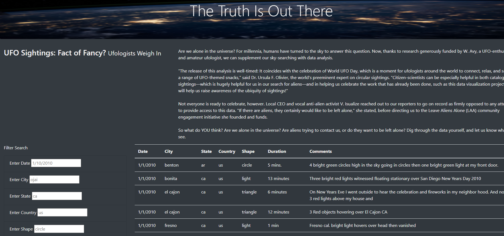
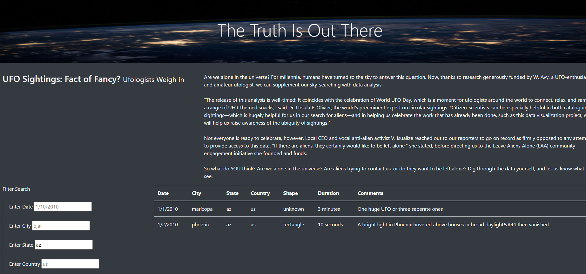

# UFOs

## Overview of the Analysis

Dana's webpage and dynamic table are working as intended, but she would like to provide a more in-depth analysis of UFO sighthings by allowing users to fileter for mutliple criteria at the same time. The date filter is already in place, but by getting rid of the "buttton" we will instead have options of filtering by city,state,country or shape.

## Results

The image above is a snippet of the webpage without any fitlers. There are placeholders within each input to help out the user on what format to use when inputting the data. 
The data is all lowercase so only lowercase will work for each input aside from the date format which is in mm/dd/yyyy. 

In the image below for an example I input the state "az" to filter the date to show only sightings in the state of Arizona. I left the shape out so we can see how many sightings there was in az all together. But if we wanted to only see a certain shape then we could also filter through that. 

## Summary

